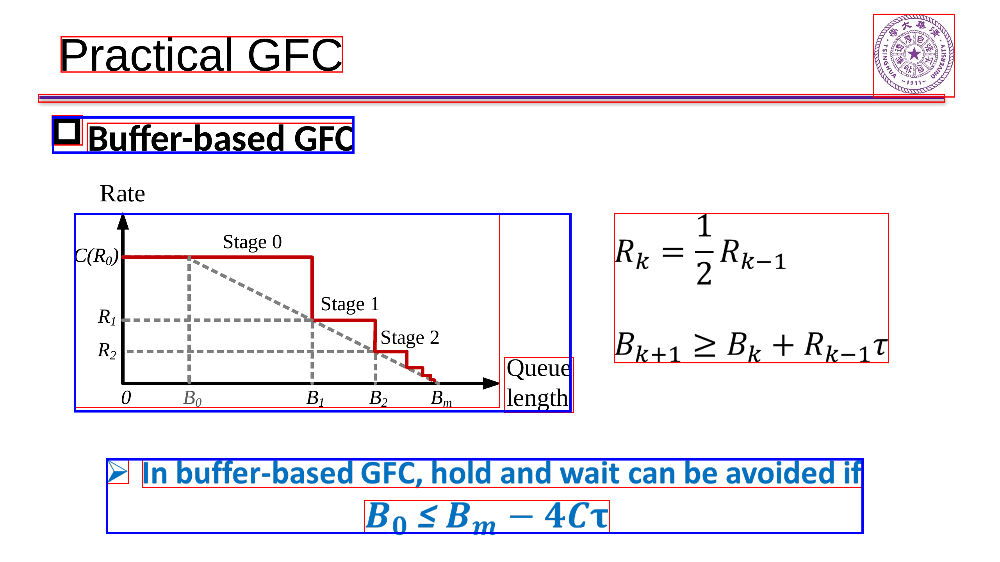
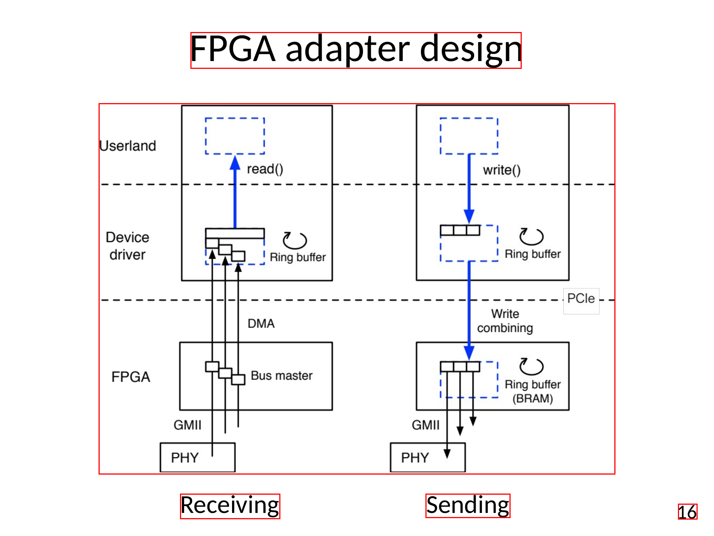
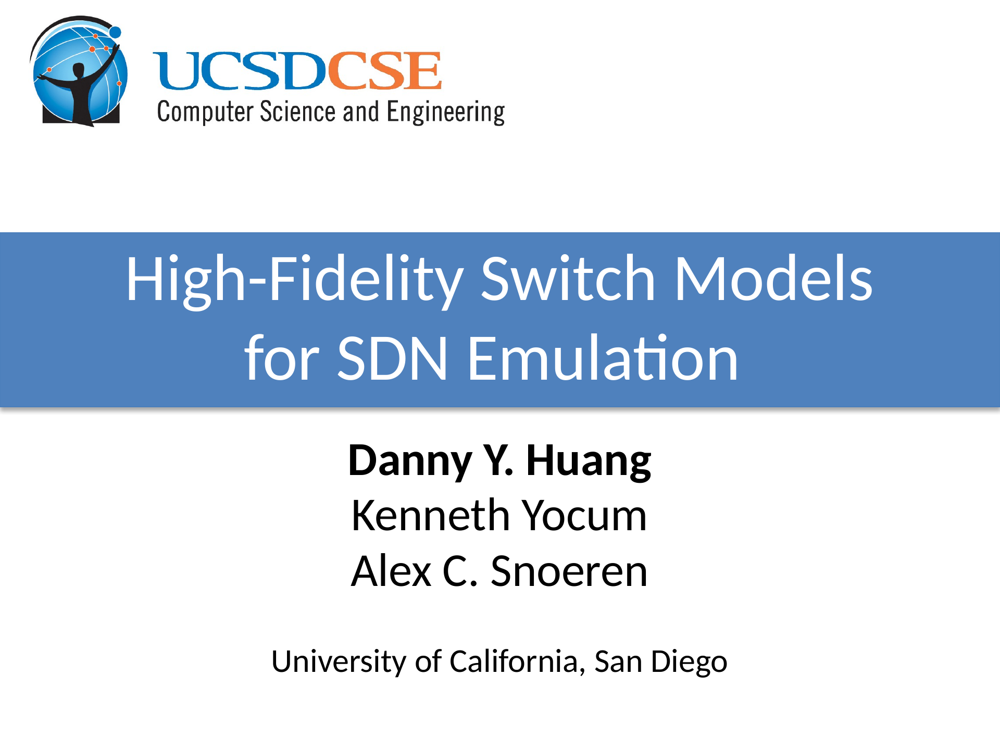
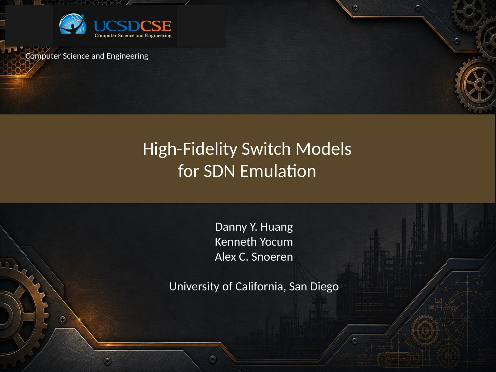
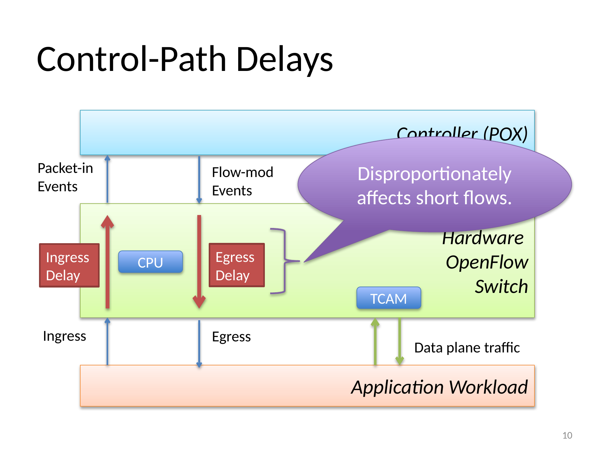
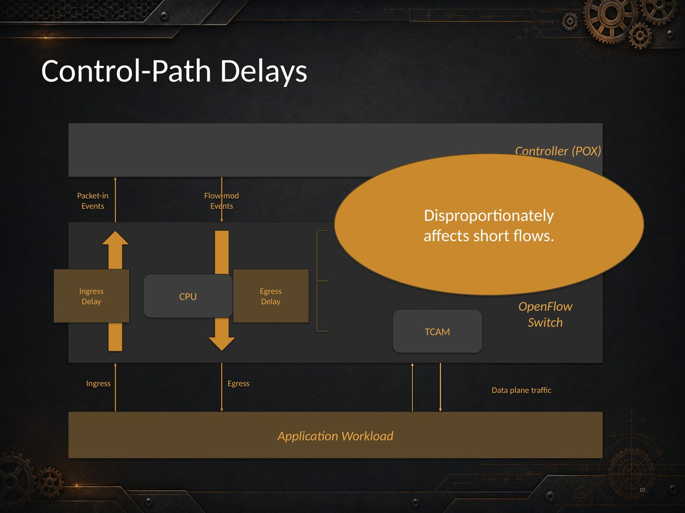
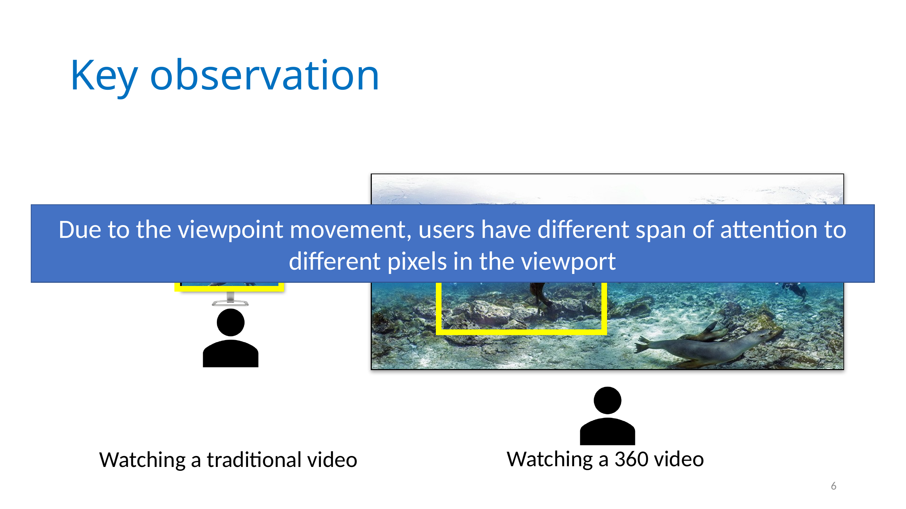
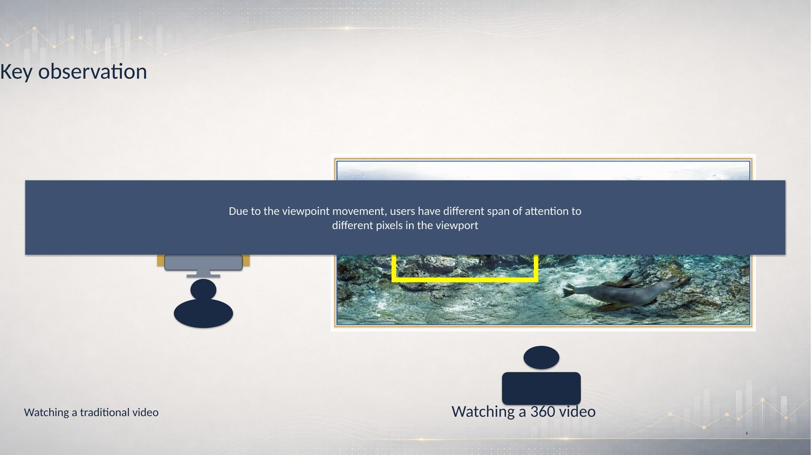

# SlideForge: An LLM Agent for Controllable Editing of Slides as Structured Artifacts

<p align="left">
  <!-- TODO: link the arXiv badge once the paper is on arXiv -->
  
  <a href="paper/SlideForge.pdf"></a>
  <a href="https://huggingface.co/zoezheng126/slideforge-sam3-decoder"></a>
  <a href="LICENSE"></a>
</p>

Official code release for **SlideForge** — an agentic framework that treats
slide editing as *structured-artifact editing* rather than pixel-space
generation.

A slide deck is not a sequence of rendered images: it is a structured
artifact of editable text, shapes, charts, tables, groups, and themes.
SlideForge builds a **Deck State Graph (DSG)** — an executable slide state
that links what is *visible* (rendered components), what is *editable*
(native PPTX objects), and what must be *preserved* — and uses it to edit
and restyle decks while keeping content, layout, and native editability
intact.

## The pipeline at a glance

| Paper stage | What it does | Code |
|---|---|---|
| **Stage I — Deck State Graph construction** | Perception-aligned decomposition: a fine-tuned SAM3 detector + cross-modal VLM grounding recover human-referable components, merge groups, missed regions, and z-order from each rendered slide | [`decomposition/`](decomposition/) + [`sam3/`](sam3/) |
| **DSG** | The executable graph state: slide / component / object nodes with containment, reading-order, z-order, merge, and edit-binding edges | [`dsg/`](dsg/) |
| **Stage II — Slide-native editing harness** | Grounds an instruction to DSG nodes (target scope vs. preservation scope) and executes constrained PPTX-level operations | prompts & harness in [`decomposition/prompts.py`](decomposition/prompts.py), [`restyle/`](restyle/) |
| **Stage III — Theme-preserving reconstruction** | Restyles a deck under a target theme: deck-level aesthetic contract, modality-aware reconstruction (classes 0–5), palette-constrained assembly | [`restyle/`](restyle/) |
| **Stage IV — Verification & self-repair** | Rendered-state verification: deterministic WCAG contrast audit, deterministic composition, OCR-diff self-repair | [`restyle/step4b_contrast_audit.py`](restyle/step4b_contrast_audit.py), [`restyle/step5b_selfrepair.py`](restyle/step5b_selfrepair.py) |

## Examples

**Stage I — decomposition into a Deck State Graph.** Each detected
component node carries a mask crop, bbox, taxonomy label, granularity, and
z-index. Note the perception-aligned granularity: a flowchart made of many
boxes and arrows is recovered as *one* editable unit, while logos, charts,
and formulas stay independent components
([full example runs](examples/decomposition/)):

| Mixed text / chart / formulas / logo | Diagram kept as one coherent unit |
|---|---|
|  |  |

**Stage III/IV — theme-preserving restyling.** Same content, same layout,
new visual theme — and the output stays a natively editable `.pptx`
([industrial](examples/restyle/SIGCOMM2013_hotsdn__06__industrial/) ·
[finance](examples/restyle/SIGCOMM2019__paper_9_2__finance/)):

| Original | Restyled (dark industrial) |
|---|---|
|  |  |
|  |  |

| Original | Restyled (finance) |
|---|---|
|  |  |

Each example dir also ships the final editable `final.pptx` and the
OCR-based content-preservation report `ocr_diff.json`.

## Setup

### 1. Python environments

```bash
git clone https://github.com/UIUC-MONET/SLIDEFORGE.git && cd SLIDEFORGE

# main environment
python3 -m venv .venv && source .venv/bin/activate
# install a torch build matching your CUDA first, e.g.:
pip install torch torchvision --index-url https://download.pytorch.org/whl/cu124
pip install -r requirements.txt
pip install -e ./sam3          # the SAM3 detector package
```

The OCR-based metrics and deterministic sizing priors run `easyocr` in a
subprocess. By default they use the current interpreter; to keep the heavy
OCR stack in its own environment, install `easyocr` there and point
`SLIDECODER_PYTHON` at that interpreter.

### 2. System dependencies

```bash
sudo apt-get install libreoffice poppler-utils fonts-crosextra-carlito
```

* **LibreOffice** (`soffice`) renders PPTX for verification, headless.
* **poppler** (`pdftoppm`) rasterizes at 96 DPI so renders match source pixels.
* **Carlito** fonts: deterministic font sizing measures text with Carlito
  (LibreOffice's metric-compatible Calibri substitute).

### 3. Checkpoints (~6.7 GB)

```bash
scripts/download_checkpoints.sh
# -> sam3/checkpoints/sam3.pt             (base SAM3, from facebook/sam3)
# -> sam3/checkpoints/sam3_slideforge.pt  (SlideForge fine-tuned decoder)
```

The fine-tuned slide-component decoder is hosted at
[`zoezheng126/slideforge-sam3-decoder`](https://huggingface.co/zoezheng126/slideforge-sam3-decoder)
(SAM License); the base checkpoint comes from Meta's official
[`facebook/sam3`](https://huggingface.co/facebook/sam3).

### 4. Model backends 

Every VLM/LLM call goes through a pluggable backend:

* `claude` / Anthropic API — `export ANTHROPIC_API_KEY=...`
* `claude_cli` — routes calls through the [`claude` CLI](https://claude.com/claude-code)
  on a Claude Code subscription (no API key; this is how the paper's
  headline runs were billed)
* `openai`, `gemini` — `export OPENAI_API_KEY=...` / `GEMINI_API_KEY=...`

For Stage III, styled-background generation and class-5 raster repaint use
`gpt-image-2` (`OPENAI_API_KEY`); set `SKIP_OPENAI=1` to run without them.
Keys can also be placed in `restyle/api_keys.txt`
(see [`restyle/api_keys.txt.example`](restyle/api_keys.txt.example)); the
file is gitignored — never commit real keys.

## Running the pipeline

### Stage I — build the Deck State Graph

```bash
# decompose rendered slides (PNG dir or JSON list of paths)
scripts/run_decomposition.sh examples/input_slides runs/demo cuda:0
```

This launches the persistent SAM3 worker (checkpoints load once, jobs take
seconds instead of minutes) and runs the release configuration: three-tier
model cascade (Haiku screening → Sonnet judgment → Opus escalation, 5%
Opus audit), validity cascade, and merge-acceptance caps. Per slide it
writes the DSG component state under `runs/demo/<slide>/final/`:
`metadata.json` (components with bbox, taxonomy label, granularity,
z-index, LaTeX for formulas), mask crops in `components/`, bbox crops in
`bbox_components/`, and the cleaned background per iteration.

Materialize the graph:

```bash
python -m dsg.build_dsg --run-dir runs/demo --out runs/demo/dsg.json
# DeckStateGraph: N slide(s), M component(s), K edge(s) ...
```

### Stage III/IV — theme-preserving restyling

```bash
cd restyle

# 1) ingest the Stage I DSG state into a case workspace
python step0_ingest_dsg.py --run-dir ../runs/demo --out-dir output/demo

# 2) write your target theme into style_prompt.txt (three ready-made
#    themes ship with the repo: industrial / finance / warm)
cp style_prompt_industrial.txt style_prompt.txt

# 3) run reconstruction in the release configuration
export CLAUDE_BACKEND=cli          # or unset + ANTHROPIC_API_KEY for the API
export FONT_SIZING=deterministic COVERAGE_GATE=hard
python run_pipeline.py --case demo --out-dir output/demo
```

The result is `output/demo/final.pptx` — restyled, verified,
self-repaired, and still natively editable — plus `ocr_diff.json` with
per-page content-coverage metrics.

### Evaluation

Decomposition state recovery (reconstruction SSIM/LPIPS/CLIP, SCAN
coverage, VLM component/holistic judges):

```bash
python decomposition/eval/run_eval.py --input runs/demo \
    --metrics all --vlm-provider claude-api
```

Restyling content preservation (OCR coverage / height-ratio / duplication)
is produced by the pipeline itself (`ocr_diff.json`); `restyle/metrics/`
contains the standalone scripts.

### Fine-tuning the detector yourself

`sam3/tune_decoder.py` + `sam3/run_finetune.sh` train the lightweight
decoder adaptation (30.4M params) against the 306-class taxonomy in
[`data/sam3_text_types_306.json`](data/sam3_text_types_306.json).
Training annotations are derived automatically from native PPTX structure
(see paper App. B; ~4.7 h on 2× RTX 4090 for the released model).

## Cost & runtime

Measured on five six-slide test decks (paper App. B): decomposition
$2.18/deck (~416 s), restyling $2.41/deck (~664 s), ~149 model calls per
deck for the full pipeline. The backends are model-adaptive — swapping the
escalation model changes cost/quality trade-offs.

## Repository layout

```
decomposition/   Stage I: DSG construction (agents, prompts, backends, eval)
dsg/             Deck State Graph data structure + builder
restyle/         Stage III/IV: theme-preserving reconstruction + verification
sam3/            SAM3 detector (vendored Meta SAM3 + fine-tuning + inference)
data/            306-class slide-component taxonomy (+ 38-class variant)
examples/        demo inputs, a Stage I run, and two restyled decks
scripts/         checkpoint download + one-command Stage I runner
paper/           the paper PDF
```

## License

The SlideForge code is released under the [MIT License](LICENSE).
The `sam3/` directory vendors Meta's SAM3 and is licensed under the
[SAM License](sam3/LICENSE); the released checkpoints (base and
fine-tuned decoder) are likewise governed by the SAM License.

<!-- TODO: uncomment and fill in the arXiv id once the paper is up

## Citation

```bibtex
@article{slideforge2026,
  title   = {SlideForge: An LLM Agent for Controllable Editing of Slides
             as Structured Artifacts},
  author  = {Zheng, Haozhen and Wang, Fulin and Xiong, Tianhu and Yu, Yingjie
             and Qian, Shengyi and Yu, Hanchao and Schwing, Alex
             and Nahrstedt, Klara and Wu, Mingyuan},
  journal = {arXiv preprint arXiv:XXXX.XXXXX},
  year    = {2026}
}
```

-->

